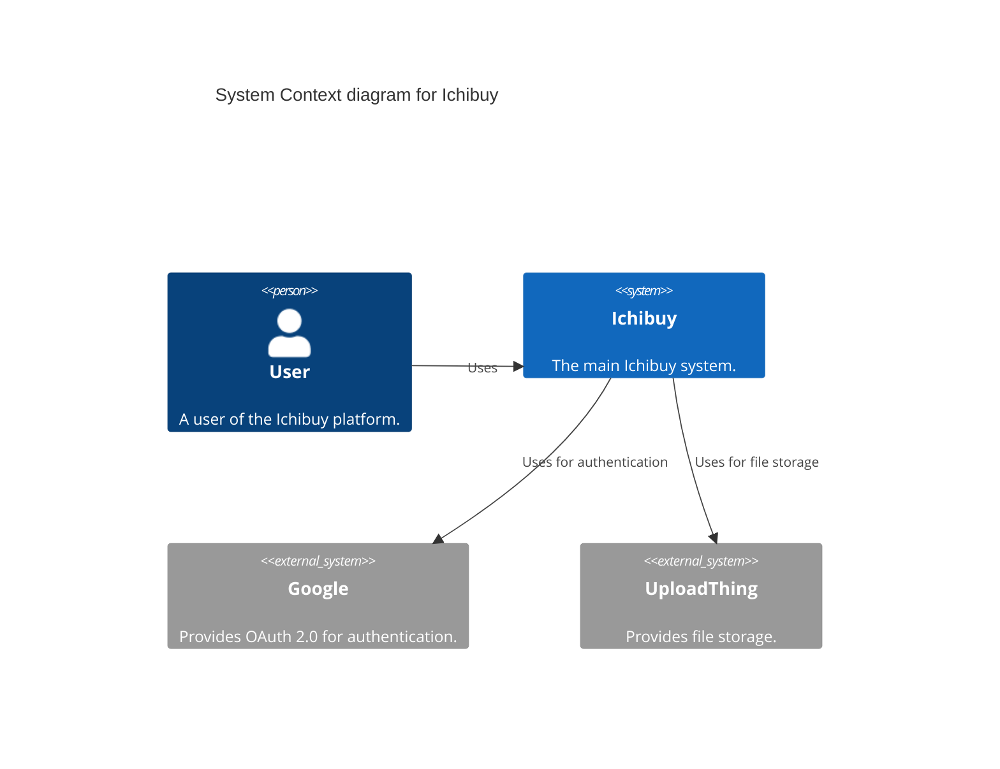
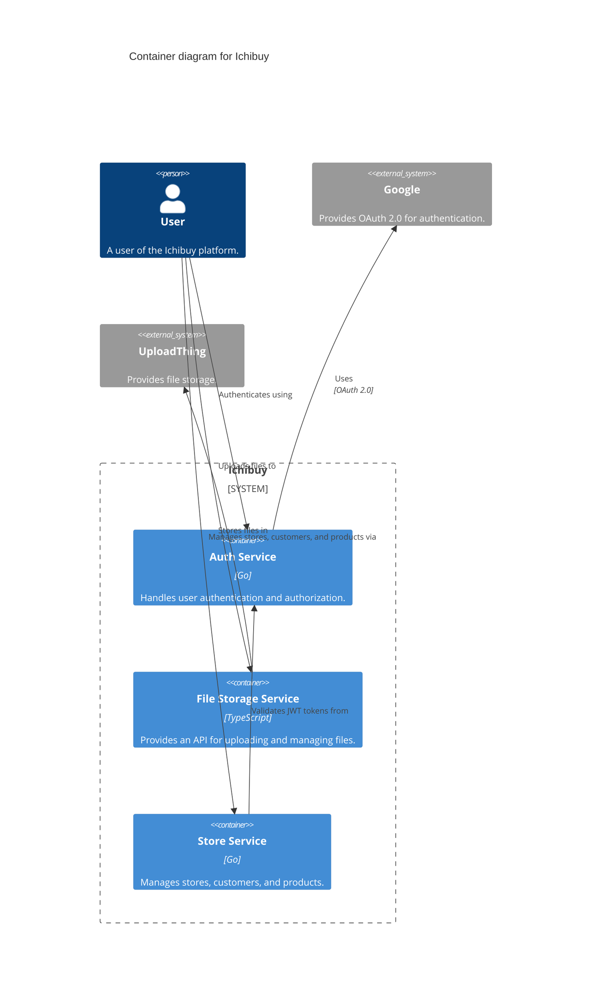

# Ichibuy

This repository contains the source code for the Ichibuy microservices-based application.

## C4 Diagrams

### System Context Diagram

### Container Diagram

## Microservices

| Service | Language | Description | Documentation |
| --- | --- | --- | --- |
| [Authentication Service](/auth) |  | Handles user authentication and authorization using Google OAuth2 and JWT. | [API Docs](https://ichibuy-auth.vercel.app/api/swagger/index.html) / [README](/auth/README.md) |
| [File Storage Service](/fstorage) |  | Provides an API for uploading and managing files. | [API Docs](https://ichibuy-fstorage.vercel.app/api/swagger) / [README](/fstorage/README.md) |
| [Store Service](/store) |  | Manages stores, customers, and products. | [API Docs](https://ichibuy-store.vercel.app/api/swagger/index.html) / [README](/store/README.md) |